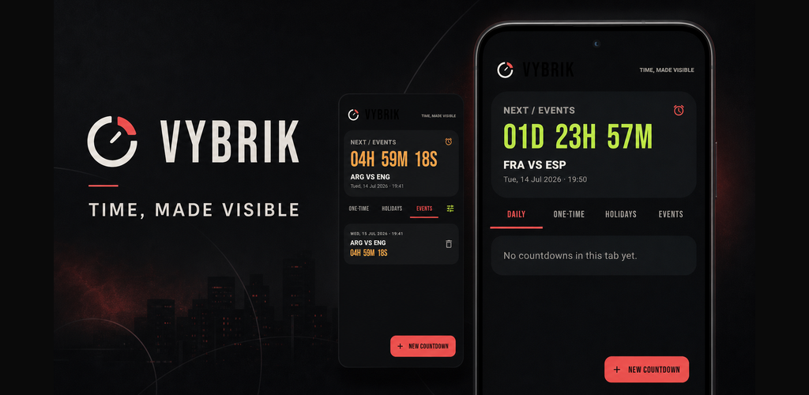
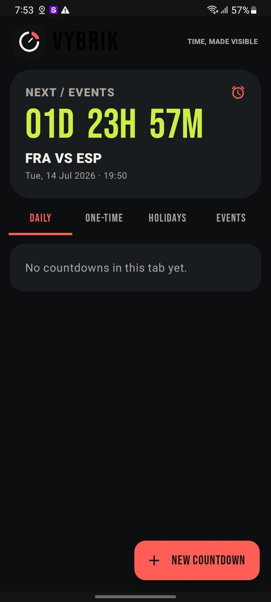
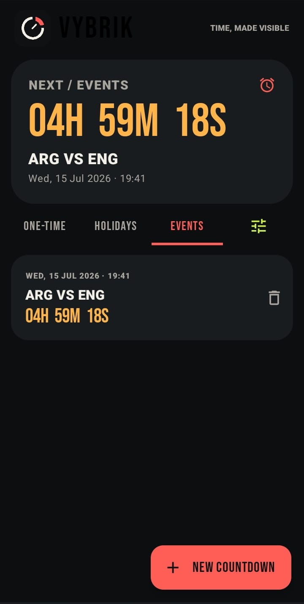
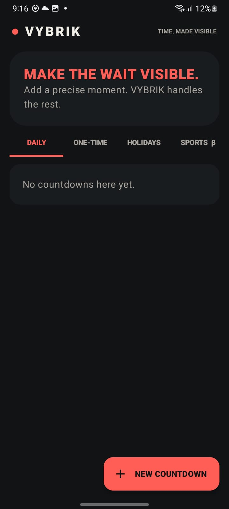
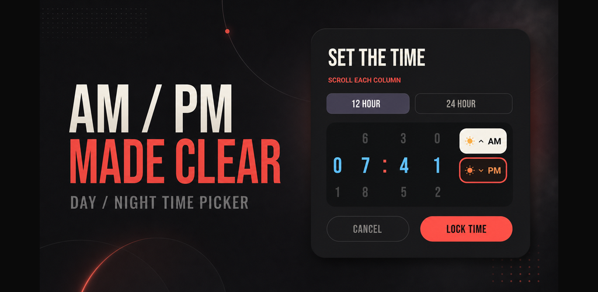
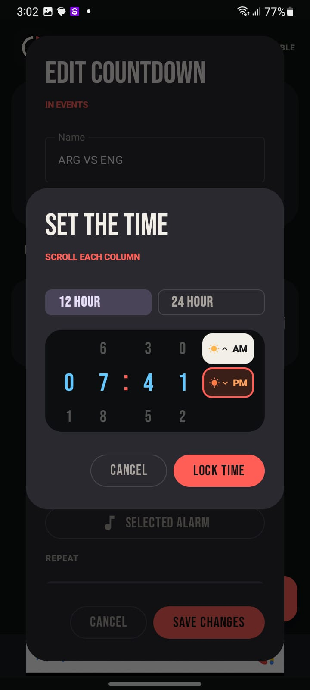

<p align="center">
  
</p>

<h1 align="center">VYBRIK</h1>

<p align="center"><strong>Time, made visible.</strong></p>

<p align="center">
  A fast, local-first countdown and alarm app for Android.<br>
  No ads. No premium wall. No account required.
</p>

<p align="center">
  
</p>

## What makes VYBRIK different

VYBRIK turns an exact moment into something you can see at a glance. Its urban-modern interface keeps the next countdown prominent while giving alarms, one-time dates, holidays, and events a clear home.

- **Accessible time entry** — choose 12-hour or 24-hour time, then scroll each digit independently.
- **AM/PM without guesswork** — rising-sun and setting-sun treatments make daytime and nighttime visually distinct.
- **Flexible alarms** — alarm, notification, or silent countdown behavior.
- **Your own alarm sounds** — import audio and reuse recently selected sounds.
- **Useful repeats** — repeat daily or choose only the weekdays that matter.
- **Editable by touch** — tap any countdown card to edit it.
- **Personal tabs** — add, rename, or remove tabs to match your life.
- **Private by default** — personal countdown data stays on the device.
- **Completely ad-free** — this repository and release contain the Pro build with no ads or paid feature gate.

## Screenshots

<table>
  <tr>
    <td align="center"><br><sub><b>Next countdown at a glance</b></sub></td>
    <td align="center"><br><sub><b>Event countdowns</b></sub></td>
    <td align="center"><br><sub><b>Calm empty state</b></sub></td>
  </tr>
</table>

### A time picker designed for clarity

<p align="center">
  
</p>

<p align="center">
  
</p>

The hour tens, hour units, minute tens, minute units, and mode are individually scrollable. Users can switch between 12-hour and 24-hour entry at any time; the AM and PM choices use day/night imagery to reduce mistakes.

## Download

Install the latest APK from the repository's **Releases** page. Android may ask you to allow installation from your browser or file manager because the APK is distributed outside Google Play.

Requirements:

- Android 8.0 (API 26) or newer
- Notification permission on Android 13+ for alarm notifications
- Exact-alarm permission where required by the device

## Build from source

1. Install Android Studio with JDK 17.
2. Clone this repository and open its root folder.
3. Copy `local.properties.example` to `local.properties`.
4. Keep Android Studio's generated `sdk.dir` value.
5. Build the ad-free edition:

```powershell
.\gradlew.bat assembleProRelease
```

For a locally installable development build:

```powershell
.\gradlew.bat assembleProDebug
```

The APK will be written beneath `app/build/outputs/apk/pro/`.

## Editions

The Gradle project contains two product flavors:

| Flavor | Ads | Purpose |
|---|---:|---|
| `pro` | No | The ad-free edition published here |
| `free` | Yes | Optional store-supported variant |

Only the `free` flavor links Google Mobile Ads and the consent SDK. The `pro` flavor sets `BuildConfig.HAS_ADS` to `false` and does not include those dependencies.

## Architecture

- Kotlin and Jetpack Compose
- Room for local countdown storage
- Alarm scheduling that recovers after reboot, app replacement, time-zone changes, and exact-alarm permission changes
- Minified and resource-shrunk release builds
- Optional Cloudflare Worker proxy for event discovery

Countdown colors progress from bone → blue → acid → amber → coral as zero approaches, keeping urgency legible without clutter.

## Optional event data

All countdown and alarm features work offline. The optional `backend-proxy` directory contains a Cloudflare Worker that can fetch event data without exposing the provider key in the Android app.

```text
cd backend-proxy
npm install
npx wrangler secret put API_SPORTS_KEY
npm run deploy
```

Then add the deployed base URL to your untracked `local.properties`:

```properties
SPORTS_PROXY_BASE_URL=https://YOUR-WORKER.workers.dev/
```

Never commit API keys, `local.properties`, or signing keystores.

## Privacy and safety

VYBRIK does not require an account. Review [PRIVACY.md](PRIVACY.md) for the project privacy notes. Before publishing a fork, test notification denial, reboot recovery, Doze behavior, time-zone changes, and manufacturer battery-saving modes on physical devices.

## Support the project

If VYBRIK helps you and you are able to contribute, you can support development on [Ko-fi](https://ko-fi.com/fgtranime). Donations are optional and do not unlock features.

## Brand

VYBRIK and its urban-modern artwork are presented as a working product identity. Before commercial redistribution under the same name, perform the appropriate trademark and store-listing checks for your region.

---

<p align="center">Built by <strong>DopaLAb</strong>.</p>
